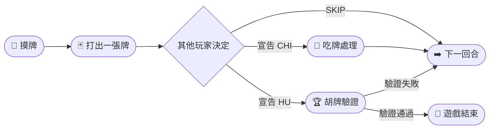

## 🀄 英文字母麻將 English Mahjong

以麻將的回合制規則為骨架，以英文拼字為核心的即時多人對戰遊戲。
玩家輪流摸牌、打牌，搶先將手中 **16 張字母牌**全部拼成合法英文單字者獲勝！

👉 **[立即遊玩 → english-mahjohn.onrender.com](https://english-mahjohn.onrender.com/)**

---

## 🎯 遊戲概念

傳統麻將有「萬、條、筒」三種花色；English Mahjong 只有一種牌：**英文字母**。
26 個字母依照英語實際使用頻率分配數量——E 有 17 張、T 有 12 張、而 J、Q、Z 各只有 1 張。
玩家必須在有限的字母中找出可以拼出的英文單字，考驗的不只是詞彙量，更是臨場策略！

---

## 🎮 三種遊戲模式

| 模式 | 說明 |
|---|---|
| 👤 **單人模式** | 一名玩家對抗三隻 AI 對手，可選擇 AI 難度 |
| 👥 **多人模式** | 最多四名玩家共用同一個房間，掃 QR Code 即可加入 |
| 📺 **Host 展示模式** | 全牌面公開的旁觀者視角，專為投影大螢幕展示設計 |

---

## ▶️ 遊戲流程

1. **摸牌** — 輪到自己時，從牌堆抽一張字母牌
2. **出牌** — 選一張不需要的牌打出（點兩下確認）
3. **吃牌 CHI** — 如果對手打出的牌能與你的手牌湊成英文單字，可以喊 CHI 吃進來
4. **胡牌 HU** — 手牌全部拼完後按下 HU 按鈕，輸入所有單字，伺服器驗證正確即宣告勝利！

---

## 🤖 AI 對手

AI 使用**遞迴回溯演算法（Recursive Backtracking）**，在 30 萬筆英文字典中即時搜尋所有可能的單字組合，共分四段難度：

| 難度 | AI 認識的字 | 胡牌機率 |
|---|---|---|
| Beginner | 字庫 1% | 5% |
| Intermediate | 字庫 5% | 15% |
| Advanced | 字庫 10% | 35% |
| Ultimate | 字庫 20% | 75% |

難度越高，AI 能認識的單字越多、反應越快，也越難被擊敗！

---

## 🛠️ 技術架構

**後端**：Python / Flask / Flask-SocketIO / Eventlet（非同步即時通訊）  
**前端**：Vanilla JavaScript / Socket.IO Client / canvas-confetti（勝利動畫）  
**字典**：30 萬筆英文詞彙（words.json）+ 詞頻排序（word_frequencies.json）  
**部署**：Render 雲端平台（gunicorn + eventlet worker）
