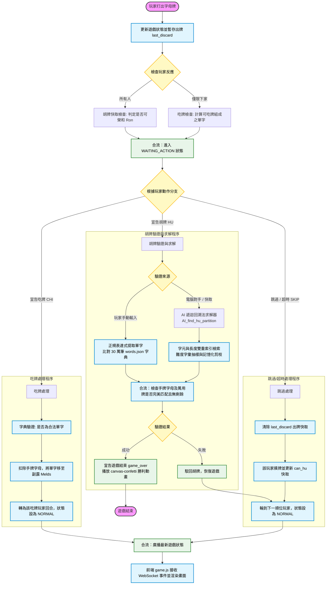

# 🀄 English Mahjong（英文字母麻將）

###### 系統與網站開發 ｜ 社團展覽 2026

---

> [!check]
> 以麻將的**回合制規則**為骨架，以**英文拼字**為核心的即時多人對戰遊戲。
> 玩家輪流摸牌、打牌，搶先將手中所有字母牌拼成合法英文單字者獲勝！
>
> 👉 線上遊玩：**https://english-mahjohn.onrender.com**

　

## 遊戲簡介

> English Mahjong 以英文 26 個字母取代傳統麻將牌。字母數量依照英語實際字元出現頻率分配，每位玩家每局發得 **16 張牌**，輪流進行摸牌與出牌，目標是將手上所有牌拼成合法的英文字典詞彙。

支援三種遊戲模式：

- **單人模式** — 一名玩家對抗三隻電腦模擬對手，可自選難度
- **多人模式** — 最多四名玩家共用一個房間，掃 QR Code 即可加入
- **Host 展示模式** — 全牌面公開的旁觀者視角，專為投影大螢幕展示設計

------

## 牌組設計

字母數量依英語字元使用頻率分配，確保遊戲的可玩性：

| 頻率等級 | 字母與數量 |
| --- | --- |
| 高頻（≥ 8 張） | E ×17、T ×12、A ×11、O ×10、N ×9、I ×9、H ×8、R ×8、S ×8 |
| 中頻（2–6 張） | D ×6、L ×5、U ×4、C ×4、F ×3、G ×3、W ×3、Y ×3、M ×3、B ×2、P ×2 |
| 低頻（1 張） | J、K、Q、V、X、Z |

<< 字母分配依據英語語料庫中的實際出現頻率設計

　

> [!note]
> 越常見的字母越容易抽到，但也更容易被對手利用。罕見字母（如 Q、Z）雖然難用，卻能拼出高難度的長單字！

------

## 回合流程

每一回合分為以下四個階段：

1. **摸牌**：當前玩家從牌堆頂端自動抽一張字母牌
2. **出牌**：選一張不需要的手牌打出（點兩下確認，防止誤觸）
3. **反應階段**：其他玩家在此時機可以選擇
    - 🈁 **吃牌 CHI** — 下家可截取此牌，與手牌湊成合法英文單字放入組合區
    - 🏆 **胡牌 HU** — 任意玩家若能以此牌完成手牌拼字，可按下 HU 宣告
    - ➡️ **跳過 SKIP** — 放棄此回合的行動機會
4. **胡牌驗證**：宣告 HU 後全場暫停，輸入所有獲勝單字，由伺服器比對字典確認

　

> [!tip]
> 胡牌按鈕**常駐**於畫面，不限只在反應階段使用——只要你認為手牌可以全部拼完，隨時都可以宣告！

------

## 電腦對手系統

### 難度等級

| 難度 | 字典抽樣比例 | 胡牌觸發機率 | 吃牌策略 |
| --- | --- | --- | --- |
| 🟢 Beginner | 1%（約 3,000 字） | 5% | 偏好短單字 |
| 🟡 Intermediate | 5%（約 15,000 字） | 15% | 隨機選擇 |
| 🟠 Advanced | 10%（約 30,000 字） | 35% | 偏好長單字 |
| 🔴 Ultimate | 20%（約 60,000 字） | 75% | 偏好長單字 |

<< 電腦對手每次行動會從 30 萬筆字典中隨機「想起」一部分單字，難度越高認識越多

　

### 核心演算法：遞迴詞彙分割

> [!info]
> 電腦對手的胡牌判斷使用**遞迴回溯法（Recursive Backtracking）搭配記憶化（Memoisation）**：
>
> 1. 取手牌中第一個字母，透過預建的字元／長度**雙重索引**查詢候選單字
> 2. 依難度對候選詞進行詞彙量過濾（從字庫隨機抽樣）
> 3. 若手牌字母足夠組成某候選詞，扣除後**遞迴處理**剩餘手牌
> 4. 基底情況：所有字母耗盡 → 胡牌成立；否則**回溯**嘗試下一候選詞

　

**效能保護措施：**

- 雙重索引結構（字元索引 ＋ 長度索引），候選詞查詢複雜度為 **O(1)**
- 詞頻排序，常用詞優先嘗試，提高找到解的速度
- 每層遞迴候選詞上限 **30 個**，防止橫向搜尋爆炸
- 全域呼叫次數上限 **400 次**，避免伺服器因單次計算過長而卡頓

　

> [!warning]
> Ultimate 難度的電腦對手胡牌觸發機率高達 **75%**，且偏好拼出長單字，是非常難以擊敗的對手！

------

## 系統架構

### 後端

| 元件 | 技術 |
| --- | --- |
| Web 框架 | Python / Flask |
| 即時通訊 | Flask-SocketIO（WebSocket）|
| 非同步事件循環 | Eventlet |
| 詞彙主題驗證 | Google Gemini API（選配）|

### 前端

| 元件 | 技術 |
| --- | --- |
| 遊戲邏輯與畫面渲染 | Vanilla JavaScript（`game.js`）|
| 即時事件 | Socket.IO Client 4.x |
| 拖拉排牌 | Pointer Events API |
| 音效合成 | Web Audio API |
| 勝利動畫 | canvas-confetti |
| 字型 | Google Fonts（Inter、Orbitron、Outfit）|

### 資料

| 資料 | 說明 |
| --- | --- |
| `words.json` | 英文字典，約 30 萬筆詞彙 |
| `word_frequencies.json` | 詞頻排序清單，供電腦對手難度設定使用 |

　

> [!note]
> 所有遊戲狀態由**後端統一維護**，透過 WebSocket 廣播至所有客戶端，確保四名玩家的畫面即時同步，杜絕作弊的可能性。

------

## 核心處理流程（Process）

為確保即時多人對戰遊戲的流暢度與公平性，系統將核心邏輯（吃牌、胡牌、AI 決策、狀態更新）集中於後端，並透過 WebSocket 連線同步至前端。以下是系統的核心決策與資料處理流程：

------

## 功能特色

- [x] 即時多人連線（Socket.IO WebSocket）
- [x] 四段難度電腦模擬對手（遞迴回溯演算法）
- [x] Host / TV 旁觀者展示模式
- [x] 吃牌（CHI）與胡牌（HU）宣告機制
- [x] 伺服器端字典驗證（防止輸入非英文單字）
- [x] 資訊隱藏（對手看不到你的手牌）
- [x] 回合計時器
- [x] 拖拉排牌（可自由調整手牌順序）
- [x] 合成音效與勝利動畫

------

## 線上體驗

> [!check]
> **👉 https://english-mahjohn.onrender.com**
>
> 無需安裝任何程式，開啟瀏覽器即可直接遊玩！
> 建議使用 **Chrome** 或 **Edge** 瀏覽器以獲得最佳體驗。

<< 支援桌機與手機，多人模式可掃描 QR Code 快速加入同一房間
