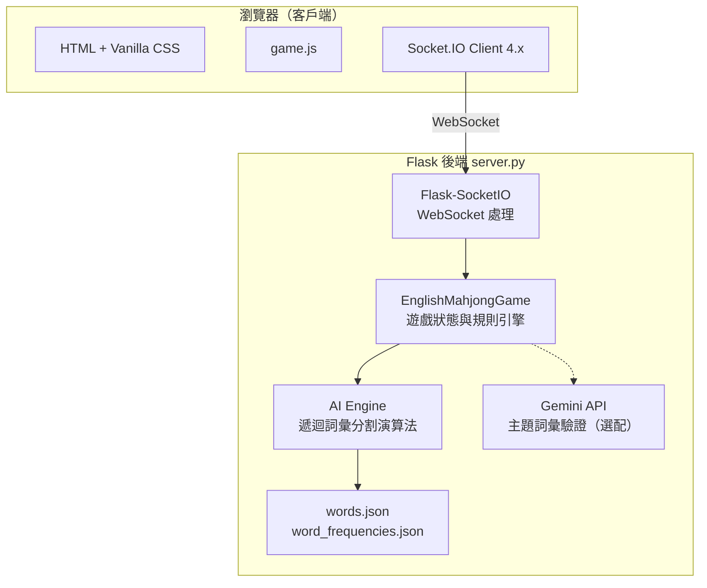
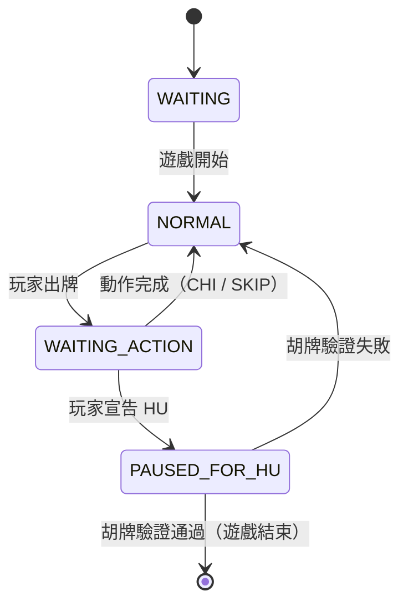

# 🀄 English Mahjong（英文字母麻將）

以麻將的回合制機制為骨架、英文詞彙拼組為核心的多人即時連線遊戲。玩家抽取並打出字母牌，搶先將手牌全部組合成合法英文單字者獲勝。

---

## 目錄

- [專案簡介](#專案簡介)
- [功能特色](#功能特色)
- [系統架構](#系統架構)
- [遊戲玩法](#遊戲玩法)
- [AI 系統](#ai-系統)
- [安裝與執行](#安裝與執行)
- [專案結構](#專案結構)
- [部署](#部署)
- [Socket.IO API 參考](#socketio-api-參考)
- [設定參數](#設定參數)

---

## 專案簡介

English Mahjong 以英文 26 個字母取代傳統麻將牌。字母張數依照英語實際字元出現頻率分配（如 E ×17、T ×12、A ×11），每位玩家每局發得 **16 張牌**，輪流進行摸牌與出牌，目標是將手上所有牌拼成一組合法的英文字典詞彙。

支援三種遊戲模式：

- **單人模式** — 一名玩家對抗三隻 AI 對手
- **多人模式** — 最多四名玩家共用一個房間
- **旁觀者 / Host 模式** — 全牌面公開的唯讀視角，適合投影展示或主持

---

## 功能特色

| 功能 | 說明 |
|---|---|
| 🎮 **即時多人連線** | 透過 Socket.IO WebSocket 同步所有客戶端的遊戲狀態 |
| 🤖 **AI 對手** | 四段難度，以詞彙量抽樣作為難度基準 |
| 📺 **旁觀者模式** | Host / TV 端可見所有玩家手牌，適合解說或投影 |
| 🈁 **吃牌（CHI）** | 截取上家出牌，與手牌組成合法英文單字 |
| 🏆 **胡牌（HU）** | 手動輸入獲勝單字組合，由伺服器驗證後宣告勝利 |
| ♻️ **斷線重連** | 玩家以原始名稱重新整理後可繼續加入進行中的遊戲 |
| 🔒 **資訊隱藏** | 其他玩家的手牌內容與吃牌選項不會傳送至對手客戶端 |

---

## 系統架構



### 後端

| 元件 | 技術 |
|---|---|
| Web 框架 | Flask |
| 即時通訊 | Flask-SocketIO（WebSocket） |
| 非同步事件循環 | Eventlet |
| AI 主題驗證 | Google Gemini API *（選配）* |
| 執行環境 | Python 3.10+ |

### 前端

| 元件 | 技術 |
|---|---|
| 遊戲邏輯與畫面渲染 | Vanilla JavaScript（`game.js`） |
| 即時事件 | Socket.IO Client 4.x |
| 勝利動畫 | canvas-confetti |
| 字型 | Google Fonts（Inter、Orbitron、Outfit） |

---

## 遊戲玩法

### 牌組設計

字母數量依英語字元使用頻率分配：

| 頻率等級 | 字母 |
|---|---|
| 高頻（≥8 張） | E ×17、T ×12、O ×10、A ×11、I ×9、N ×9、S ×8、H ×8、R ×8 |
| 低頻（1 張） | J、K、Q、X、Z |

每位玩家開局持有 **16 張牌**。

### 回合流程


1. **摸牌**：當前玩家從牌堆頂端抽一張牌。
2. **出牌**：選擇一張手牌打出（點兩下確認，防止誤觸）。
3. **反應**：下一順序玩家可宣告 **吃牌（CHI）**；任何玩家可宣告 **胡牌（HU）**。
4. **胡牌驗證**：遊戲暫停，宣告者需手動輸入獲勝單字組合，手牌中所有字母必須全部使用。

### 遊戲狀態機



---

## AI 系統

### 難度等級

| 難度 | 詞彙量（佔總字庫比例） | 胡牌觸發機率 | 吃牌策略 |
|---|---|---|---|
| Beginner | 1% | 5% | 偏好短單字 |
| Intermediate | 5% | 15% | 隨機選擇 |
| Advanced | 10% | 35% | 偏好長單字 |
| Ultimate | 20% | 75% | 偏好長單字 |

### 核心演算法：遞迴詞彙分割

AI 的胡牌判斷使用**遞迴回溯法（Recursive Backtracking）搭配記憶化（Memoisation）**：

1. 取手牌第一個字母。
2. 透過預建的字元／長度雙重索引，查詢所有包含該字母的候選單字。
3. 依難度對候選詞進行詞彙量過濾（從字庫隨機抽樣）。
4. 若手牌字母足夠組成某候選詞，扣除使用的字母後遞迴處理剩餘手牌。
5. 基底情況：所有字母耗盡 → 胡牌成立；否則回溯嘗試下一候選詞。

**效能保護措施：**

- 雙重索引結構（字元索引 + 長度索引），候選詞查詢為 O(1)
- 詞頻排序，常用詞優先嘗試
- 每層遞迴候選詞上限 30 個，防止橫向搜尋爆炸
- 全域呼叫次數上限（預設 400 次），避免伺服器卡頓
- 定期呼叫 `eventlet.sleep(0)` 讓出事件循環控制權

---

## 安裝與執行

### 環境需求

- Python 3.10 以上

### 安裝步驟

```bash
# 建立並啟用虛擬環境
python -m venv .venv
.venv\Scripts\activate        # Windows
# source .venv/bin/activate   # macOS / Linux

# 安裝依賴套件
pip install -r requirements.txt
```

### Gemini API Key 設定（選配）

在專案根目錄建立 `gemini_key.txt`，將 API Key 貼入：

```
AIza...
```

或設定環境變數：

```bash
export GEMINI_API_KEY="AIza..."
```

### 啟動伺服器

```bash
python server.py
```

伺服器預設監聽 `http://0.0.0.0:5001`。啟動後終端機會顯示區域網路位址：

```
* Server running on LAN: http://192.168.1.x:5001
```

同一網路內的裝置可直接導覽至該位址加入遊戲。

---

## 專案結構

```
majan/
├── server.py                  # 後端核心：Flask、SocketIO、遊戲引擎、AI
├── requirements.txt           # Python 依賴套件清單
├── build.py                   # 建置工具腳本
├── filter_proper_nouns.py     # 字典前處理：過濾專有名詞
├── solve.py                   # 獨立胡牌求解器（測試用）
├── test_hu.py                 # 胡牌邏輯單元測試
│
├── templates/
│   └── index.html             # Jinja2 HTML 進入點
│
└── static/
    ├── css/
    │   └── style.css          # 全域樣式（深色主題、動畫效果）
    ├── js/
    │   └── game.js            # 客戶端遊戲邏輯與 Socket.IO 整合
    ├── words.json             # 英文字典（約 30 萬筆詞彙）
    ├── word_frequencies.json  # 詞頻排序清單（供 AI 難度使用）
    └── themes.json            # 主題詞彙包（選配功能）
```

---

## 部署

本專案針對 **Render** 雲端平台進行設定。

**Build 指令：**
```bash
pip install -r requirements.txt
```

**Start 指令：**
```bash
gunicorn --worker-class eventlet -w 1 server:app
```

**環境變數：**

| 變數 | 必要 | 說明 |
|---|---|---|
| `PORT` | Render 自動提供 | 伺服器監聽埠 |
| `GEMINI_API_KEY` | 選配 | 啟用 Gemini 主題詞彙驗證 |

線上版本：[english-mahjohn.onrender.com](https://english-mahjohn.onrender.com)

---

## Socket.IO API 參考

### 客戶端 → 伺服器

| 事件 | 承載資料 | 說明 |
|---|---|---|
| `join` | `{ room, username, mode, role, difficulty }` | 加入或建立房間 |
| `start_game` | `{ room }` | 觸發遊戲開始 |
| `discard` | `{ tile_index }` | 依索引打出一張手牌 |
| `action_chi` | `{ word }` | 以單字宣告吃牌 |
| `action_skip` | — | 放棄吃牌或胡牌機會 |
| `declare_hu` | — | 暫停遊戲並宣告胡牌 |
| `submit_hu` | `{ words }` | 提交獲勝單字組合 |
| `reorder_hand` | `{ hand }` | 同步手牌排列順序 |
| `chat_message` | `{ username, msg }` | 廣播聊天訊息 |
| `add_ai` | — | 在大廳中手動加入 AI 玩家 |

### 伺服器 → 客戶端

| 事件 | 承載資料 | 說明 |
|---|---|---|
| `game_state` | 完整狀態物件 | 權威性遊戲狀態同步 |
| `my_hand` | `{ hand }` | 玩家個人手牌更新（私有） |
| `turn_update` | `{ current_turn, player_sid, state }` | 當前行動玩家通知 |
| `game_over` | `{ winner, melds, hand }` | 對局結束，含獲勝者資訊 |
| `broadcast_meld_anim` | `{ word, player, is_hu }` | 觸發吃牌或胡牌動畫 |
| `message` | `{ msg }` | 系統廣播訊息 |
| `error` | `{ msg }` | 操作錯誤回饋 |
| `chat_message` | `{ username, msg, pos_index }` | 聊天訊息廣播 |

---

## 設定參數

| 常數 | 位置 | 預設值 | 說明 |
|---|---|---|---|
| `GLOBAL_DEBUG` | `server.py` | `False` | 啟用詳細伺服器日誌 |
| `ai_interval` | `EnglishMahjongGame` | `5.0s` | AI 每次行動的思考延遲 |
| `call_cap` | `AI_find_hu_partition` | `400` | 每次胡牌檢查的最大遞迴呼叫數 |
| `COMMON_LETTERS` | `server.py` | `A–W 排除 Q,X,Z,J,Y` | 隨機出牌限制的字母池 |
