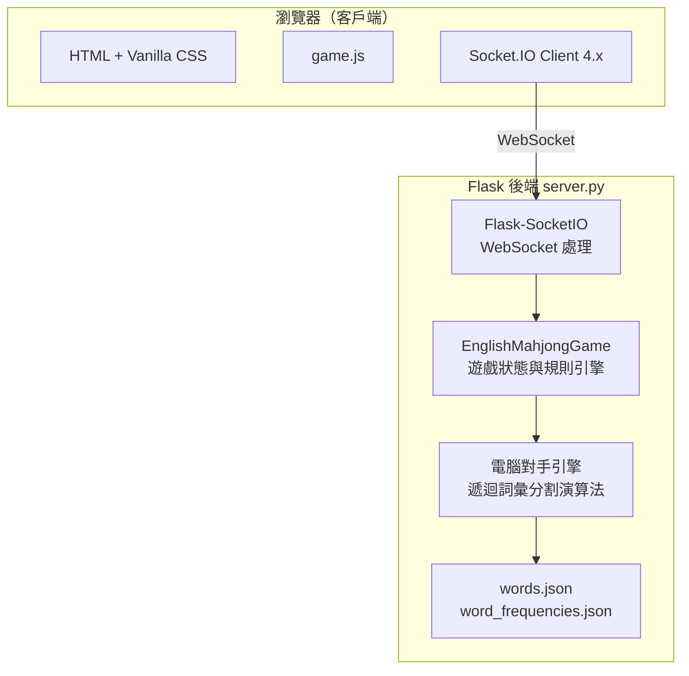
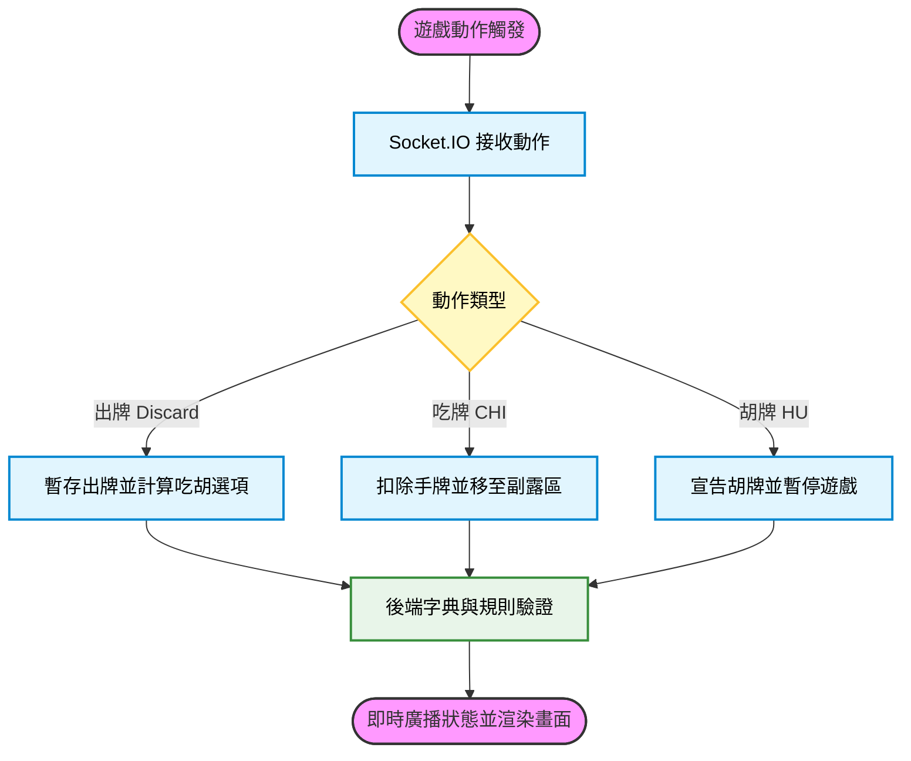
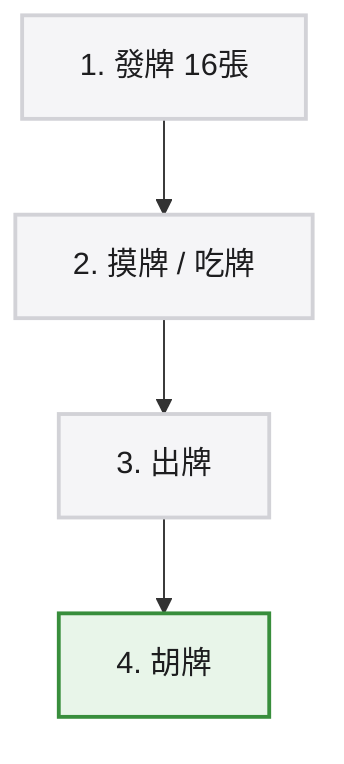

# 🀄 English Mahjong（英文字母麻將）

以麻將的回合制機制為骨架、英文詞彙拼組為核心的多人即時連線遊戲。玩家抽取並打出字母牌，搶先將手牌全部組合成合法英文單字者獲勝。

---

## 目錄

- [專案簡介](#專案簡介)
- [功能特色](#功能特色)
- [系統架構](#系統架構)
- [核心處理流程](#核心處理流程)
- [使用方式](#使用方式)
- [電腦對手系統](#電腦對手系統)
- [線上遊玩](#線上遊玩)
- [專案結構](#專案結構)

---

## 專案簡介

English Mahjong 以英文 26 個字母取代傳統麻將牌。字母張數依照英語實際字元出現頻率分配（如 E ×17、T ×12、A ×11），每位玩家每局發得 **16 張牌**，輪流進行摸牌與出牌，目標是將手上所有牌拼成一組合法的英文字典詞彙。

支援兩種遊戲模式：

- **單人模式** — 一名玩家對抗三隻電腦模擬對手
- **多人模式** — 最多四名玩家共用一個房間

---

## 功能特色

- 🎮 **即時多人連線**：基於 Socket.IO WebSocket 技術，實現毫秒級多人即時連線同步
- 🤖 **四段難度電腦對手**：Beginner 至 Ultimate 難度，使用字典隨機抽樣演算法模擬真實詞彙量
- 🈁 **吃牌（CHI）與胡牌（HU）機制**：無縫融合傳統麻將規則與 30 萬筆英文單字字典驗證
- 🔒 **資訊安全隱藏**：對手手牌與吃牌選項均在後端安全驗證，徹底杜絕客戶端作弊
- 🧩 **手牌拖拉排序**：整合 Pointer Events API 提供流暢且自由的手牌拖曳排列體驗
- 🎨 **動態音效與勝利特效**：整合 Web Audio API 即時合成音效，並在胡牌時觸發 canvas-confetti 慶祝動畫

---

## 系統架構



### 後端

| 元件 | 技術 |
|---|---|
| Web 框架 | Flask |
| 即時通訊 | Flask-SocketIO（WebSocket） |
| 非同步事件循環 | Eventlet |
| 執行環境 | Python 3.10+ |

### 前端

| 元件 | 技術 |
|---|---|
| 遊戲邏輯與畫面渲染 | Vanilla JavaScript（`game.js`） |
| 即時事件 | Socket.IO Client 4.x |
| 勝利動畫 | canvas-confetti |
| 字型 | Google Fonts（Inter、Orbitron、Outfit） |

---

## 核心處理流程（Process）

為確保即時多人對戰遊戲的流暢度與公平性，系統將核心邏輯集中於後端，並透過 WebSocket 連線同步至前端。以下是系統的核心決策與資料處理流程：



---

## 使用方式（Usage）

遊戲以 26 個英文字母取代傳統麻將，每位玩家開局持有 **16 張牌**，輪流摸牌與出牌，最先拼完手牌者獲勝。



> [!tip]
> 💡 簡報或 Canva 使用，可直接下載專案根目錄的高畫質圖檔：**[SVG 向量圖 (usage.svg)](usage.svg)** | **[PNG 高畫質圖 (usage.png)](usage.png)**


1. `[摸牌與出牌]`：自動摸牌，雙擊打出
   - 回合開始時自動摸一張牌，雙擊手牌確認打出，防止誤觸。
   - 支援滑鼠與觸控拖曳手牌，自由調整排序。

2. `[吃牌 CHI]`：截取上家，組合單字
   - 當上家出牌時，若能與手牌組成合法單字即可宣告吃牌。
   - 吃牌所組成的英文單字將會移入副露區（公開展示）。

3. `[胡牌 HU]`：全手牌合法，宣告獲勝
   - 手牌（含副露單字）必須能夠恰好組合成合法的英文字典詞彙，且不能多餘。
   - 可在任何時機按下胡牌按鈕宣告 HU，由伺服器進行字典驗證。

---

## 電腦對手系統

### 難度等級

| 難度 | 詞彙量（佔總字庫比例） | 胡牌觸發機率 | 吃牌策略 |
|---|---|---|---|
| Beginner | 1% | 5% | 偏好短單字 |
| Intermediate | 5% | 15% | 隨機選擇 |
| Advanced | 10% | 35% | 偏好長單字 |
| Ultimate | 20% | 75% | 偏好長單字 |

### 核心演算法：遞迴詞彙分割

電腦對手的胡牌判斷使用**遞迴回溯法（Recursive Backtracking）搭配記憶化（Memoisation）**：

1. 取手牌第一個字母。
2. 透過預建的字元／長度雙重索引，查詢所有包含該字母的候選單字。
3. 依難度對候選詞進行詞彙量過濾（從字庫隨機抽樣）。
4. 若手牌字母足夠組成某候選詞，扣除使用的字母後遞迴處理剩餘手牌。
5. 基底情況：所有字母耗盡 → 胡牌成立；否則回溯嘗試下一候選詞。

---

## 線上遊玩

本專案已部署至雲端，無需本機安裝即可直接遊玩：

👉 **[立即遊玩 English Mahjong](https://english-mahjohn.onrender.com/)**

---

## 專案結構

```
majan/
├── server.py                  # 後端核心：Flask、SocketIO、遊戲引擎、電腦對手
├── requirements.txt           # Python 依賴套件清單
├── build.py                   # 建置工具腳本
├── filter_proper_nouns.py     # 字典前處理：過濾專有名詞
├── solve.py                   # 獨立胡牌求解器（測試用）
├── test_hu.py                 # 胡牌邏輯單元測試
│
├── templates/
│   └── index.html             # Jinja2 HTML 進入點
│
└── static/
    ├── css/
    │   └── style.css          # 全域樣式（深色主題、動畫效果）
    ├── js/
    │   └── game.js            # 客戶端遊戲邏輯與 Socket.IO 整合
    ├── words.json             # 英文字典（約 30 萬筆詞彙）
    └── word_frequencies.json  # 詞頻排序清單（供電腦對手難度設定使用）
```
